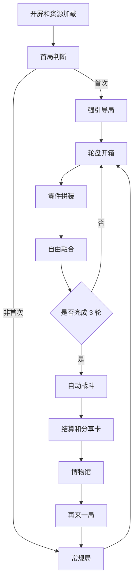

# 拼装狂潮：融合肉鸽 开发版 PRD

**版本**：v1.1-dev  
**日期**：2026-05-30  
**来源文档**：`拼装狂潮_融合肉鸽_PRD(1).md`  
**目标平台**：抖音互动空间 / HTML5 移动端浏览器  
**推荐技术栈**：TypeScript + Vite + Canvas 2D + Web Audio + LocalStorage  
**单局目标时长**：60 秒  
**开发目标**：先做出 1 个可录屏传播的完整闭环，再逐步扩展零件、融合、博物馆和调参系统。

---

## 1. 摘要

本 PRD 将原有创意版 PRD 重构为开发版规格。重点补齐功能边界、模块拆分、开发流程、素材生产管线、验收标准和测试要求。

产品核心是一个竖屏 H5 小游戏。玩家在 60 秒内完成开箱、拖拽拼装、任意融合、自动战斗和分享收藏。每局都要产出一张有传播价值的武器卡片或博物馆记录。

---

## 2. 干系人和职责

| 角色 | 主要职责 | 备注 |
|---|---|---|
| 产品负责人 | 控制 MVP 范围、确认体验节奏、验收可玩性 | 本文档默认由产品负责人维护 |
| 客户端开发 | 实现状态机、Canvas 渲染、交互、战斗和存档 | 优先保证移动端流畅 |
| 游戏策划 | 维护零件表、融合规则、战斗数值、掉落权重 | 配置表应可快速改 |
| 美术 / Image2 操作者 | 生成零件、融合武器、敌人和分享卡资产 | Image2 用于开发期出图，不建议运行时生成 |
| 音效设计 | 制作开箱、吸附、融合、攻击、超载音效 | 可先用临时音效占位 |
| 测试 / 发布 | 兼容性、性能、抖音互动空间适配、分享链路验证 | 每次发布前跑冒烟测试 |

---

## 3. 背景和约束

### 3.1 背景

原 PRD 的创意方向明确：把肉鸽的随机 Build、组合反应和死亡遗产压缩到分钟级，并用物理拼装制造奇葩外观和传播点。

开发上最大的挑战不在规则复杂度，而在 60 秒内让玩家连续感到“我在创造”“我想看结果”“我愿意截图”。因此 MVP 不追求大量内容，优先做强反馈、强节奏和稳定闭环。

### 3.2 平台约束

| 约束 | 开发含义 |
|---|---|
| 竖屏单手 | 所有主要操作集中在屏幕中下部，拖拽距离不能太长 |
| 3 秒上手 | 首局必须强引导，常规局不能依赖文字说明 |
| 60 秒单局 | 每阶段必须有硬时间上限，超时自动推进 |
| 抖音互动空间 | 资源体积、首屏速度、分享卡生成都要优先验证 |
| 移动 H5 | 避免重 WebGL 依赖；Canvas 2D 更稳 |
| 传播导向 | 分享卡、录屏画面、奇葩命名比长期养成更重要 |

---

## 4. 产品目标

### 4.1 体验目标

1. 玩家首次进入后 3 秒内知道要点轮盘。
2. 玩家首次拼装时能在 5 秒内完成一次拖拽吸附。
3. 玩家首次融合时能立即看到“两个东西变成一个更离谱的东西”。
4. 战斗阶段玩家无需操作，但画面必须在 5 秒内证明 Build 有效果。
5. 每局结束必须生成可截图、可分享的结果页。

### 4.2 业务和传播目标

| 指标 | MVP 目标 | 说明 |
|---|---:|---|
| 首局完成率 | >= 70% | 完成从开箱到战斗结算 |
| 首局主动点击再来一局 | >= 35% | 表示核心循环成立 |
| 分享卡生成率 | >= 50% | 不等于真实分享，但代表有分享意愿 |
| 平均单局时长 | 55-75 秒 | 允许因设备略有波动 |
| 低端机战斗帧率 | >= 45fps | 超载时允许短时下降 |
| 首屏加载时间 | < 2 秒 | 以常见移动网络缓存后体验为准 |

### 4.3 关键结果

| KR | 验收方式 |
|---|---|
| 完成 1 条端到端游戏闭环 | 新用户可从开屏玩到博物馆并再开一局 |
| 至少 18 个基础零件可掉落 | 物理、元素、抽象各不少于 5 个 |
| 至少 12 个融合武器有专属命名和表现 | 其余组合走混沌 fallback |
| 至少 3 套分享卡模板 | 奇葩型、伤害型、坟场型 |
| 博物馆本地保存不少于 20 局 | 刷新页面后记录仍存在 |

---

## 5. 目标用户和使用场景

### 5.1 目标用户

| 用户类型 | 需求 | 设计重点 |
|---|---|---|
| 抖音轻度玩家 | 不想学习复杂系统，只想马上爽 | 强引导、自动战斗、大反馈 |
| 喜欢抽卡和随机 Build 的玩家 | 想看到离谱组合和爆炸数字 | 轮盘、融合、超载 |
| 喜欢整活传播的用户 | 想获得可截图、可发朋友的结果 | 奇葩外观、命名、分享卡 |
| 比赛评审 / 试玩者 | 想快速理解亮点和完成体验 | 30 秒内展示差异化 |

### 5.2 核心场景

1. 用户刷到分享卡或入口，点进游戏。
2. 用户不读说明，直接点轮盘。
3. 用户把几个零件随便拖到角色身上。
4. 用户尝试把两个零件拖到一起，得到融合武器。
5. 用户看自动战斗和超载爆发。
6. 用户看到自己的武器和数据，截图或点再来一局。

---

## 6. 价值主张

| 价值 | 具体表现 |
|---|---|
| 创造爽感 | 任意零件都能装，外观实时变化 |
| 随机爽感 | 轮盘掉落、融合命名和混沌结果带来未知感 |
| 爆发爽感 | 自动战斗快速验证 Build，超载制造数字溢出 |
| 传播爽感 | 奇葩武器、离谱数据、坟场收藏都能做成卡片 |
| 复玩爽感 | 博物馆和挖坟机制让下一局有一点遗产 |

---

## 7. 范围定义

### 7.1 MVP 必须包含

1. 竖屏 H5 游戏壳和主状态机。
2. 首局强引导。
3. 轮盘开箱，支持 3 轮掉落。
4. 零件栏、角色骨架、6 个连接点。
5. 拖拽吸附、替换、回弹。
6. 任意两个已装零件可融合。
7. 标签驱动的融合规则和混沌 fallback。
8. 自动战斗 3 波敌人。
9. 至少 6 种战斗效果基元。
10. 超载模式。
11. 结算页、分享卡截图、博物馆本地记录。
12. 基础埋点接口，可先输出到 console。

### 7.2 V1.1 可加入

1. 更多融合武器立绘。
2. 低画质模式。
3. 挖坟开局遗物。
4. 3 套分享卡 A/B 模板。
5. 更多 Boss 行为和敌人外观。
6. 配置表热更新或远程配置。

### 7.3 暂不做

1. 后端账号系统。
2. 实时排行榜。
3. 复杂 Roguelike 地图。
4. 多角色职业系统。
5. 运行时 AI 生成图片。
6. WebGL 3D 武器展示。

---

## 8. 用户流程

### 8.1 总流程



### 8.2 首次进入

| 步骤 | 时间上限 | 交互 | 成功标准 |
|---|---:|---|---|
| 开屏 | 1s | 无 | Logo 或标题出现，无白屏 |
| 教学轮盘 | 5s | 点击停止 | 必定抽到预设零件 |
| 教学拼装 | 8s | 拖零件到高亮点 | 吸附成功，有咔哒反馈 |
| 教学融合 | 8s | 拖刀刃到火焰宝石 | 生成火焰刀 |
| 教学战斗 | 20s | 无 | 火焰刀击杀第一波敌人 |
| 结算引导 | 5s | 点击分享或再来一局 | 用户理解结果页 |

### 8.3 常规局节奏

| 阶段 | 建议时长 | 设计要求 |
|---|---:|---|
| 第 1 轮开箱 | 5s | 让玩家获得 3 个基础零件 |
| 第 1 轮拼装 | 10s | 完成基础外观 |
| 第 1 轮融合 | 10s | 鼓励主动融合，不操作也可跳过 |
| 第 2 轮开箱 | 5s | 补充元素和抽象零件 |
| 第 2 轮拼装 | 5s | 快速替换或新增 |
| 第 2 轮融合 | 5s | 出现至少 1 个融合武器 |
| 第 3 轮开箱 | 5s | 必掉融合催化剂 |
| 第 3 轮拼装 | 5s | 给最后调整机会 |
| 自动战斗 | 30s | 3 波敌人，Boss 和超载 |
| 结算 / 博物馆 | 5s | 生成卡片和记录 |

---

## 9. 系统需求

### 9.1 游戏状态机

所有阶段由统一状态机驱动，避免散落的 setTimeout 难以维护。

| 状态 | 进入条件 | 退出条件 |
|---|---|---|
| `loading` | 页面启动 | 资源加载完成 |
| `home` | 非强制，可用于回到首页 | 点击开始 |
| `tutorial` | 首次进入 | 教学完成或跳过 |
| `loot` | 每轮开始 | 轮盘停止并发放零件 |
| `assembly` | 获得零件后 | 倒计时结束或点击继续 |
| `fusion` | 拼装后 | 融合成功、倒计时结束或跳过 |
| `combat` | 3 轮完成 | Boss 死亡或玩家死亡 |
| `result` | 战斗结束 | 点击博物馆、分享或再来 |
| `museum` | 从结果页进入 | 点击再来一局 |

验收标准：

1. 任意状态都能通过调试按钮重置到新局。
2. 倒计时结束后必须自动推进。
3. 页面隐藏再恢复时，计时不能出现负数或卡死。

### 9.2 轮盘开箱系统

功能要求：

1. 轮盘有 8 个格子，每格显示零件剪影或图标。
2. 点击任意位置可停止轮盘。
3. 停止时有减速动画、tick 音、指针停顿。
4. 每轮发放 3 个零件。
5. 第 3 轮额外发放 1 个融合催化剂。
6. 同局内基础零件不重复掉落。

掉落池建议：

| 类别 | 数量 | 权重 | 示例 |
|---|---:|---:|---|
| 物理 | 8 | 40% | 刀刃、枪管、弹簧、火箭、鱼、搋子、齿轮、电锯 |
| 元素 | 6 | 35% | 火、冰、雷、毒、风、暗影 |
| 抽象 | 6 | 25% | 祝福、诅咒、KPI、拖延症、友情、暴富 |

验收标准：

1. 连续 20 局不会出现空奖励。
2. 掉落结果能写入局内 inventory。
3. 轮盘动画在低端模式下仍流畅。

### 9.3 零件和库存系统

功能要求：

1. 零件可以处于库存、已装配、已融合、已消耗 4 种状态。
2. 底部库存栏最多显示 6 个零件，超过后横向滑动。
3. 每个零件至少包含名称、类型、标签、稀有度、图标、默认战斗触发器。
4. 已融合或被消耗的零件不再参与后续融合。

验收标准：

1. 拖拽过程中零件不会丢失。
2. 替换装配后旧零件回到库存。
3. 局内重开会清空库存，但不清空博物馆。

### 9.4 超级拼装系统

连接点：

| 槽位 | 屏幕位置 | 可装类型 | 表现重点 |
|---|---|---|---|
| `head` | 角色头部 | 任意 | 奇葩外观最明显 |
| `body` | 躯干 | 任意 | 防御或光环效果 |
| `left_hand` | 左手 | 任意 | 近战、射击 |
| `right_hand` | 右手 | 任意 | 近战、射击 |
| `back` | 背部 | 任意 | 喷射、召唤、范围 |
| `feet` | 脚部 | 任意 | 位移、地面效果 |

交互要求：

1. 按住零件后进入拖拽态，零件放大 1.1 倍。
2. 接近连接点 80px 时出现磁吸。
3. 进入 40px 内松手即装配成功。
4. 装配成功播放咔哒音效和 50ms 震动。
5. 同槽位新零件会顶掉旧零件。
6. 所有零件允许装到任意槽位，系统不做逻辑限制。

验收标准：

1. 玩家单手拖拽可完成拼装。
2. 横向窄屏设备上零件不遮挡继续按钮。
3. 装配后角色外观立即变化。

### 9.5 自由融合系统

交互要求：

1. 玩家拖动一个已装配零件到另一个已装配零件上。
2. 两者碰撞后触发融合确认，不要求二次确认。
3. 融合成功后原两个零件消失，生成融合产物。
4. 融合产物自动吸附到优先槽位。
5. 弹出公式文案，例如“刀刃 + 火焰宝石 = 火焰刀”。

规则要求：

1. 优先查找专属融合规则。
2. 无专属规则时，按标签合成效果基元。
3. 标签仍无明显结果时，生成混沌武器。
4. 任意两个零件都必须有融合结果。
5. 融合结果要可参与战斗，但 MVP 中不允许二次融合，以控制复杂度。

验收标准：

1. 任选两个已装零件都能融合成功。
2. 融合前后的库存和槽位状态正确。
3. 连续快速拖拽不会重复生成多个融合产物。

### 9.6 融合规则引擎

优先级：

1. `exactRecipe`：精确配方，例如刀刃 + 火 = 火焰刀。
2. `tagRecipe`：标签配方，例如任意金属 + 雷 = 电磁系武器。
3. `primitiveMerge`：效果基元叠加，例如燃烧 + 穿透。
4. `chaosFallback`：混沌生成，保证不失败。

效果基元：

| 基元 | 战斗表现 | 视觉表现 |
|---|---|---|
| `burn` | 持续伤害，命中后小爆炸 | 橙红拖尾 |
| `freeze` | 减速，短暂定身 | 蓝白冰晶 |
| `shock` | 弹射，连锁伤害 | 紫白电弧 |
| `poison` | 毒圈，持续扣血 | 绿色烟雾 |
| `pierce` | 穿透多个敌人 | 直线光束 |
| `homing` | 自动追踪最近敌人 | 弯曲弹道 |
| `knockback` | 击退小怪 | 冲击波 |
| `glitch` | 精神伤害，扰乱敌人 | 黑白故障 |

### 9.7 自动战斗系统

战斗要求：

1. 玩家不需要操作。
2. 战斗地图为单屏竖屏空间。
3. 敌人从上方和两侧生成，向角色移动。
4. 角色自动按触发器攻击。
5. 每个已装配零件或融合武器都有独立触发器。
6. 所有触发器并行运行，不互相抢冷却。

波次：

| 波次 | 时间 | 敌人 | 目的 |
|---|---:|---|---|
| 第 1 波 | 0-8s | 5 个小怪 | 验证基础零件 |
| 第 2 波 | 8-18s | 10 个小怪 + 精英怪 | 验证融合武器 |
| 第 3 波 | 18-30s | 1 个 Boss + 小怪 | 触发超载和结算高潮 |

验收标准：

1. 至少 5 种攻击效果能在同局同时出现。
2. 敌人死亡、伤害数字、命中特效清晰可见。
3. 战斗结束必然进入结算页，不会卡在战斗态。

### 9.8 超载模式

触发条件满足任一即可：

1. Boss 出场后 5 秒。
2. Combo 达到 12。
3. 单次伤害超过当前 Boss 血量的 20%。

超载效果：

1. 所有触发器频率提升 2 倍。
2. 伤害提升 2 倍。
3. 粒子密度提升，但受性能上限限制。
4. 背景变暗，屏幕边缘出现红色警告框。
5. 触发 0.3 秒慢镜头和屏幕震动。

验收标准：

1. 每局 Boss 阶段大概率触发超载。
2. 超载不超过 8 秒，避免视觉疲劳。
3. 低端模式下超载只增加关键特效，不堆粒子。

### 9.9 结算、分享卡和博物馆

结算页必须展示：

1. 本局终极武器图。
2. 武器名称。
3. 零件清单。
4. 最高秒伤。
5. 最高 Combo。
6. 融合次数。
7. 胜利或死亡标签。

分享卡要求：

1. 9:16 竖屏图片。
2. 背景采用战斗截图或博物馆背景。
3. 中央展示武器立绘。
4. 下方展示核心数据。
5. 支持保存到本地或触发平台分享能力。

博物馆要求：

1. LocalStorage 保存最近 20 局。
2. 每条记录包含缩略图、日期、武器名、核心数据。
3. 死亡局显示墓碑样式。
4. 胜利局显示陈列架样式。
5. V1.1 支持选择一条记录作为开局遗物。

验收标准：

1. 刷新页面后博物馆记录仍存在。
2. 分享卡生成不依赖网络。
3. 生成失败时显示可截图的静态结算页。

---

## 10. 技术方案

### 10.1 推荐架构

```text
src/
  main.ts
  game/
    GameApp.ts
    GameStateMachine.ts
    GameLoop.ts
    InputController.ts
  systems/
    LootSystem.ts
    InventorySystem.ts
    AssemblySystem.ts
    FusionSystem.ts
    CombatSystem.ts
    OverdriveSystem.ts
    MuseumSystem.ts
    ShareCardSystem.ts
    AnalyticsSystem.ts
  render/
    CanvasRenderer.ts
    SpriteAtlas.ts
    ParticleSystem.ts
    DamageTextLayer.ts
  data/
    parts.json
    fusion_rules.json
    enemies.json
    balance.json
  assets/
    parts/
    weapons/
    enemies/
    ui/
    audio/
```

### 10.2 核心原则

1. 游戏逻辑和渲染分离。
2. 主要内容走 JSON 配置，不写死在代码中。
3. 所有状态切换由状态机管理。
4. 所有移动对象进入对象池，减少战斗阶段 GC。
5. Image2 生成素材在开发期离线处理，不在玩家设备运行。
6. 首屏只加载 MVP 必要资源，博物馆和分享模板可延迟加载。

### 10.3 是否使用物理引擎

MVP 推荐不引入完整物理引擎。拖拽、吸附、碰撞融合可以用圆形碰撞和 tween 动画解决。

只有当后续需要大量真实弹跳、关节约束、零件雨等效果时，再考虑 Matter.js。这样可以降低包体和调试成本。

---

## 11. 数据结构

### 11.1 零件

```ts
type PartCategory = "physical" | "elemental" | "abstract" | "catalyst";
type PartState = "inventory" | "equipped" | "fused" | "consumed";
type SlotId = "head" | "body" | "left_hand" | "right_hand" | "back" | "feet";

interface PartDef {
  id: string;
  name: string;
  category: PartCategory;
  rarity: "common" | "rare" | "epic";
  tags: string[];
  weight: number;
  icon: string;
  sprite: string;
  baseTrigger?: TriggerDef;
}

interface PartInstance {
  uid: string;
  defId: string;
  state: PartState;
  slotId?: SlotId;
  createdRound: number;
}
```

### 11.2 融合规则

```ts
interface FusionRule {
  id: string;
  priority: number;
  match: {
    partIds?: string[];
    tags?: string[];
    categories?: PartCategory[];
  };
  result: {
    name: string;
    tags: string[];
    sprite: string;
    trigger: TriggerDef;
    formulaText: string;
  };
}
```

### 11.3 战斗触发器

```ts
interface TriggerDef {
  id: string;
  cooldownMs: number;
  target: "nearest" | "random" | "front" | "area";
  projectile?: ProjectileDef;
  damage: number;
  effects: EffectPrimitive[];
  visualPreset: string;
  soundId?: string;
}
```

### 11.4 博物馆记录

```ts
interface MuseumRecord {
  id: string;
  timestamp: number;
  weaponName: string;
  parts: string[];
  fusedWeapons: string[];
  maxDps: number;
  maxCombo: number;
  fusionCount: number;
  result: "victory" | "death";
  shareImageDataUrl: string;
}
```

---

## 12. 素材需求和 Image2 管线

### 12.1 素材原则

1. 素材风格要夸张、清晰、适合小屏。
2. 武器轮廓必须一眼能看懂。
3. 每个图标都要有透明背景版本。
4. 融合武器比基础零件更大、更亮、更荒诞。
5. 不依赖写实细节，优先使用粗描边、高对比、强形状。

### 12.2 资源规格

| 资源 | 尺寸 | 格式 | 用途 |
|---|---:|---|---|
| 基础零件图标 | 512x512 | PNG 透明底 | 轮盘、库存、清单 |
| 基础零件战斗 sprite | 512x512 | PNG 透明底 | 角色装配显示 |
| 融合武器立绘 | 1024x1024 | PNG 透明底 | 结算页、分享卡 |
| 敌人 sprite | 512x512 | PNG 透明底 | 战斗 |
| Boss sprite | 1024x1024 | PNG 透明底 | Boss 战 |
| 分享卡背景 | 1080x1920 | PNG/JPG | 分享卡 |
| UI 图标 | 256x256 | PNG/SVG | 按钮、标识 |

### 12.3 文件命名

```text
assets/parts/part_blade_01.png
assets/parts/part_fish_01.png
assets/weapons/weapon_fire_blade_01.png
assets/weapons/weapon_flying_fish_missile_01.png
assets/enemies/enemy_slime_01.png
assets/share/share_bg_damage_01.png
```

### 12.4 Image2 出图流程

1. 策划从 `parts.json` 和 `fusion_rules.json` 导出素材清单。
2. 美术或开发用 Image2 批量生成 3 个候选图。
3. 选择轮廓最清晰的一张。
4. 去背景，统一描边和阴影。
5. 压缩为 WebP 或 PNG。
6. 打包进 atlas，更新 sprite 映射。
7. 在 375x667 和 390x844 两档视口做可读性检查。

### 12.5 Image2 提示词模板

基础格式：

```text
竖屏移动 H5 游戏素材，一个夸张搞笑的 {物品名称}，卡通街机风格，粗黑描边，高饱和颜色，中心构图，透明背景，清晰轮廓，适合 512x512 小图标，不要文字，不要水印，不要复杂背景
```

融合武器格式：

```text
竖屏移动 H5 游戏的融合武器立绘，{零件A} 和 {零件B} 融合成 {武器名称}，外形荒诞但一眼可识别，卡通街机风格，粗黑描边，强烈发光特效，中心构图，透明背景，适合分享卡展示，不要文字，不要水印
```

### 12.6 首批素材清单

| 类型 | 名称 | 用途 | Image2 关键词 |
|---|---|---|---|
| 基础零件 | 刀刃 | 近战、火焰刀配方 | 夸张大刀刃、金属反光、粗描边 |
| 基础零件 | 枪管 | 射击、电磁炮配方 | 短粗枪管、科技感、黑灰金属 |
| 基础零件 | 弹簧 | 弹跳、击退 | 夸张螺旋弹簧、压缩形变 |
| 基础零件 | 火箭推进器 | 位移、导弹 | 小火箭喷口、红白机身、火焰尾焰 |
| 基础零件 | 鱼 | 搞笑外观、飞鱼导弹 | 蓝色死鱼眼、卡通鱼刺 |
| 基础零件 | 马桶搋子 | 搞笑近战、击退 | 红色橡胶搋子、木柄 |
| 元素零件 | 火焰宝石 | 燃烧、爆炸 | 红橙宝石、内部火焰 |
| 元素零件 | 冰霜核心 | 冰冻、减速 | 蓝白核心、冰晶外壳 |
| 元素零件 | 闪电线圈 | 弹射、电击 | 紫色电圈、闪电火花 |
| 元素零件 | 毒液罐 | 毒圈、持续伤害 | 绿色玻璃罐、冒泡毒液 |
| 抽象零件 | 朋友的祝福 | 增益、回血 | 金色手掌、爱心光环 |
| 抽象零件 | 前任的诅咒 | 精神、故障 | 黑紫诅咒符号、破碎爱心 |
| 抽象零件 | 老板的 KPI | 精神污染、高压 | 红色报表、上升箭头、压迫感 |
| 融合武器 | 火焰刀 | 刀刃 + 火 | 燃烧大刀、爆炸弧光 |
| 融合武器 | 电磁炮 | 枪管 + 雷 | 科技炮管、紫白电弧 |
| 融合武器 | 飞鱼导弹 | 火箭 + 鱼 | 火箭鱼、尾焰、滑稽表情 |
| 融合武器 | 精神污染 | 诅咒 + KPI | 故障报表怪物、黑白噪点 |
| 融合武器 | 腐冰 | 冰 + 毒 | 绿色冰晶、毒雾寒气 |
| 融合武器 | 混沌武器 | fallback | 多零件拼接、彩色能量、荒诞机械 |

---

## 13. 开发流程

### 13.1 阶段 0：技术预研和工程初始化

目标：确认 H5 技术路线可行。

交付物：

1. Vite + TypeScript 工程。
2. 移动端 Canvas 自适应。
3. 游戏主循环。
4. 触摸输入封装。
5. 简单资源加载器。
6. 调试面板，可跳转状态。

验收标准：

1. 手机浏览器能打开。
2. Canvas 按 9:16 适配，无拉伸。
3. 可稳定运行 60fps 空场景。

### 13.2 阶段 1：核心闭环灰盒

目标：没有美术也能完整玩完一局。

交付物：

1. 状态机。
2. 轮盘灰盒。
3. 库存栏。
4. 骨架和 6 个槽位。
5. 拖拽吸附。
6. 简单融合。
7. 自动战斗假敌人。
8. 结算页。

验收标准：

1. 从开局到结算全流程可跑通。
2. 任意两个零件可融合。
3. 战斗结束一定进入结算。

### 13.3 阶段 2：内容配置和规则引擎

目标：把零件、融合、敌人和数值从代码中抽出来。

交付物：

1. `parts.json`。
2. `fusion_rules.json`。
3. `enemies.json`。
4. `balance.json`。
5. 融合规则优先级。
6. 效果基元系统。
7. 混沌 fallback。

验收标准：

1. 新增零件不需要改系统代码。
2. 新增融合规则不需要改系统代码。
3. 配置错误时有清晰报错，不白屏。

### 13.4 阶段 3：战斗爽感

目标：让自动战斗有“Build 生效”的观感。

交付物：

1. 3 波敌人。
2. 触发器并行运行。
3. 投射物、范围、弹射、追踪。
4. 伤害数字。
5. Combo 计算。
6. 超载模式。
7. 粒子对象池。

验收标准：

1. 火焰刀、电磁炮、飞鱼导弹至少 3 个融合武器有明显差异。
2. Boss 阶段能稳定触发超载。
3. 同屏粒子过多时自动降级。

### 13.5 阶段 4：美术、音效和分享卡

目标：把灰盒变成可录屏传播的版本。

交付物：

1. 首批基础零件素材。
2. 首批融合武器素材。
3. 敌人和 Boss 素材。
4. 开箱、吸附、融合、攻击、超载音效。
5. 3 套分享卡模板。
6. 结算截图生成。

验收标准：

1. 关键素材在手机屏幕上清晰可辨。
2. 分享卡 9:16 输出正确。
3. 音效不会在快速操作时重叠爆音。

### 13.6 阶段 5：博物馆和复玩

目标：让每局结果有沉淀。

交付物：

1. LocalStorage 存档。
2. 最近 20 局记录。
3. 胜利陈列架。
4. 死亡墓碑。
5. 再来一局入口。
6. V1.1 挖坟遗物入口预留。

验收标准：

1. 刷新后记录存在。
2. 存档超限后删除最旧记录。
3. 存档损坏时自动重置，不影响新局。

### 13.7 阶段 6：调参、测试和平台适配

目标：达到比赛提交或外部试玩标准。

交付物：

1. 低画质模式。
2. 移动端兼容测试。
3. 首屏资源压缩。
4. 抖音互动空间 API 适配。
5. 埋点验证。
6. 试玩记录和调参表。

验收标准：

1. iPhone 8 级别设备可玩。
2. Android 中端机战斗阶段不明显卡死。
3. 10 名试玩用户中至少 7 人能不看说明完成首局。

---

## 14. 版本里程碑

| 版本 | 目标 | 内容 | 建议耗时 |
|---|---|---|---:|
| M0 | 工程可跑 | 工程、Canvas、状态机、输入 | 0.5 天 |
| M1 | 灰盒闭环 | 轮盘、拼装、融合、战斗、结算 | 1 天 |
| M2 | 核心可玩 | 配置表、规则引擎、3 波战斗、超载 | 1 天 |
| M3 | 可传播 | 美术、音效、分享卡、博物馆 | 1 天 |
| M4 | 可提交 | 调参、性能、适配、试玩修正 | 0.5-1 天 |

总计：约 4-5 天可完成比赛级 MVP。若要达到更完整的内容量，建议追加 3-5 天做素材和调参。

---

## 15. 验收清单

### 15.1 核心体验

- [ ] 首次进入 3 秒内出现可点击轮盘。
- [ ] 首局有强引导。
- [ ] 玩家可拖拽零件到 6 个槽位。
- [ ] 任意两个已装零件可融合。
- [ ] 融合结果有名称、视觉和战斗效果。
- [ ] 自动战斗不需要玩家输入。
- [ ] Boss 阶段有超载。
- [ ] 结算页展示武器、数据和分享入口。
- [ ] 博物馆保存局内结果。

### 15.2 技术质量

- [ ] 游戏无明显白屏。
- [ ] 移动端触摸事件无穿透。
- [ ] 页面切后台再回来不会卡死。
- [ ] LocalStorage 异常时可恢复。
- [ ] 战斗对象池生效，无持续内存上涨。
- [ ] 资源加载失败有 fallback。
- [ ] 低画质模式可手动或自动开启。

### 15.3 内容质量

- [ ] 基础零件不少于 18 个。
- [ ] 专属融合武器不少于 12 个。
- [ ] 混沌 fallback 至少有 6 种视觉变体。
- [ ] 分享卡模板不少于 3 套。
- [ ] 音效不少于 10 个。

---

## 16. 测试方案

### 16.1 功能测试

| 模块 | 用例 |
|---|---|
| 轮盘 | 连续开 20 局，检查掉落、去重、第三轮催化剂 |
| 拼装 | 拖拽到每个槽位，替换旧零件，库存回弹 |
| 融合 | 逐类组合测试，确认无失败结果 |
| 战斗 | 每种触发器至少触发 1 次 |
| 超载 | Combo、Boss 计时、伤害阈值三种方式都能触发 |
| 分享卡 | 生成、保存、失败 fallback |
| 博物馆 | 保存、刷新、超 20 条淘汰、损坏恢复 |

### 16.2 性能测试

| 场景 | 指标 |
|---|---|
| 空场景 | 60fps |
| 轮盘旋转 | 55fps 以上 |
| 普通战斗 | 50fps 以上 |
| 超载战斗 | 45fps 以上 |
| 分享卡生成 | 2 秒内完成 |
| 首屏加载 | 2 秒内完成 |

### 16.3 试玩测试

每轮至少找 5-10 名用户，记录：

1. 是否知道第一步要点哪里。
2. 是否能独立完成拼装。
3. 是否主动尝试融合。
4. 战斗阶段是否觉得“自己的组合生效了”。
5. 是否愿意截图或点分享。
6. 是否愿意再来一局。

---

## 17. 埋点

| 事件 | 触发时机 | 核心参数 |
|---|---|---|
| `game_load_complete` | 首屏资源加载完成 | loadMs, device |
| `game_start` | 新局开始 | isTutorial, graveBonus |
| `wheel_start` | 轮盘开始 | round |
| `wheel_stop` | 轮盘停止 | round, rewards |
| `part_drag_start` | 开始拖拽 | partId, from |
| `part_assemble` | 装配成功 | partId, slotId |
| `part_replace` | 替换槽位 | oldPartId, newPartId, slotId |
| `fusion_attempt` | 拖拽碰撞 | partA, partB |
| `fusion_success` | 融合成功 | resultId, ruleType |
| `combat_start` | 战斗开始 | parts, fusedWeapons |
| `combo_change` | Combo 达到关键档 | combo |
| `overdrive_trigger` | 超载触发 | reason |
| `combat_end` | 战斗结束 | result, duration, maxDps, maxCombo |
| `share_card_generate` | 生成分享卡 | templateId, success |
| `museum_entry_save` | 保存博物馆 | recordId, result |
| `restart_click` | 再来一局 | source |

---

## 18. 数值和调参

### 18.1 初始数值建议

| 项 | 建议值 |
|---|---:|
| 小怪生命 | 20 |
| 精英生命 | 80 |
| Boss 生命 | 800 |
| 基础攻击伤害 | 10 |
| 融合武器伤害倍率 | 2.0 |
| Combo 伤害加成 | 每 5 层 +20% |
| 超载频率倍率 | 2.0 |
| 超载伤害倍率 | 2.0 |
| 粒子上限 | 200 |
| 伤害数字上限 | 80 |

### 18.2 调参原则

1. 第一波必须让玩家看懂武器效果。
2. 第二波必须让融合武器明显强于基础零件。
3. Boss 不能太快死，否则超载没有铺垫。
4. Boss 也不能拖太久，30 秒内必须结算。
5. 伤害数字可以夸张，但真实计算要有上限，避免溢出异常。

---

## 19. 风险和应对

| 风险 | 影响 | 应对 |
|---|---|---|
| 任意融合导致内容量失控 | 规则和素材做不完 | 专属规则 + 标签规则 + 混沌 fallback |
| Image2 图风不统一 | 分享卡显得杂乱 | 统一提示词、描边、色板和后处理 |
| 战斗特效掉帧 | 爽感受损 | 对象池、粒子上限、低画质模式 |
| 新手不知道能融合 | 核心亮点缺失 | 首局强制融合，常规局用高亮和倒计时提示 |
| 分享卡不够抓眼 | 传播弱 | 武器居中放大，数据用大字，模板 A/B |
| 抖音 API 限制 | 发布受阻 | 保持纯 H5 fallback |
| LocalStorage 超限或损坏 | 博物馆丢失 | 限制 20 条，存档校验，异常重置 |

---

## 20. 待验证假设

1. 轻度玩家愿意在 60 秒内完成三轮开箱和拼装。
2. 玩家会主动尝试把两个零件拖到一起融合。
3. 奇葩武器比纯强度数值更容易触发分享。
4. 自动战斗比手动战斗更适合抖音互动空间。
5. 博物馆能提升再来一局意愿。
6. Image2 生成的融合武器能满足小屏识别和分享卡观感。

验证方式：

1. 用灰盒版本做 5 人可用性测试。
2. 用首批美术版本做 10 人传播意愿测试。
3. 记录主动融合率、再来一局率、分享卡生成率。

---

## 21. 开发 Definition of Done

一个功能只有同时满足以下条件，才算完成：

1. 功能在主流程中可访问。
2. 有正常反馈、失败反馈和超时处理。
3. 关键参数来自配置或常量表。
4. 移动端触摸可用。
5. 不破坏 60 秒局内节奏。
6. 至少通过一次手动冒烟测试。
7. 若涉及素材，已在小屏上检查可读性。
8. 若涉及存档，已验证刷新后状态。

---

## 22. 下一步建议

1. 先搭建 M0 工程和状态机。
2. 同时整理 `parts.json` 与首批 Image2 素材清单。
3. 用灰盒素材完成 M1 全流程。
4. 再投入美术和音效，不要先画完整素材后才验证玩法。
5. 每完成一个里程碑都录 30 秒手机屏幕视频，判断传播感是否成立。

---

**文档结束**
